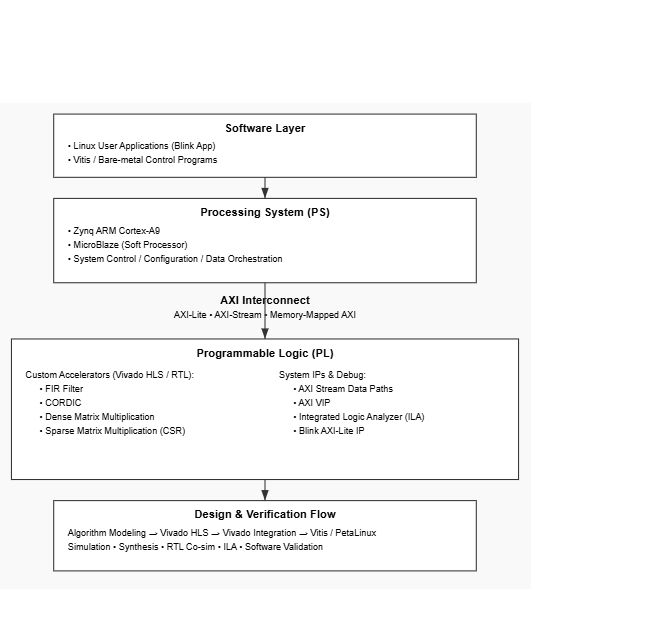

# Advanced FPGA & SoC Projects

This repository contains a curated set of FPGA and SoC projects that I personally implemented, focusing on accelerator design, system integration, and hardware–software co-design.

All projects in this repository are hands-on implementations and verification results produced by myself. Course slides or reference materials are intentionally excluded to keep the repository engineering-focused.

## Project Overview

| Category | Projects |
|--------|---------|
| DSP / Math Accelerators | FIR Filter, CORDIC |
| Compute Accelerators | Dense Matrix Multiplication, Sparse Matrix Multiplication |
| System Validation | AXI Stream, AXI VIP, ILA |
| SoC Integration | Blink IP on Vitis |

## Toolchain
- Vivado / Vivado HLS
- Vitis
- AXI (Lite / Stream), AXI VIP
- Integrated Logic Analyzer (ILA)
- Zynq SoC

Each project folder contains implementation files and validation results generated during development.

##  Projects and Links
| Category | Link |
|----------|------|
| FIR Filter Accelerator | [fir-filter-hls](labs/fir-filter-hls/README.md) |
| CORDIC Accelerator | [cordic-hls](labs/cordic-hls/README.md) |
| Dense Matrix Multiplication | [matrix-multiplication-hls](labs/matrix-multiplication-hls/README.md) |
| Sparse Matrix Multiply | [sparse-matrix-multiplication](labs/sparse-matrix-multiplication/README.md) |
| AXI Stream Validation | [axi-stream-validation](labs/axi-stream-validation/README.md) |
| Blink IP on Vitis | [blink-ip-vitis](labs/blink-ip-vitis/README.md) |

## System Architecture Overview

This repository demonstrates a layered hardware and system integration
architecture for advanced FPGA and SoC projects on Xilinx Zynq platforms.
Each component interacts through well-defined interfaces and verification flows.

### Software Layer
At the software level, embedded applications and control programs
drive and validate the underlying hardware components:

- Linux user applications (e.g., Blink control application)
- Bare-metal / Vitis control programs for accelerator interfaces

These software components interact with the hardware through
memory-mapped control interfaces (e.g., AXI-Lite) and driver APIs.

### Processing System (PS)
The Zynq Processing System (ARM Cortex-A9) and soft processors such
as MicroBlaze provide control, configuration, and orchestration:

- Zynq ARM Cortex-A9 for Linux and high-level control
- MicroBlaze soft CPU for auxiliary control flows

**Responsibilities include:**
- System control and sequencing
- Hardware configuration & setup
- DMA / data movement orchestration

### Interconnect Fabric
The AXI interconnect fabric (Lite / Stream / Memory mapped) is the backbone
connecting PS and custom accelerators:

- AXI-Lite for control/status registers
- AXI-Stream for high-throughput data transfer
- Memory-mapped AXI for coherent data access

This interconnect allows accelerators and peripherals to communicate
efficiently and predictably.

### Programmable Logic (PL)
Custom hardware accelerators and verification IP are implemented in
the FPGA fabric:

**Custom Accelerators (Vivado HLS / RTL):**
- FIR Filter accelerator with pipelining
- CORDIC sine/cosine accelerator
- Dense Matrix Multiplication accelerator
- Sparse Matrix Multiplication (CSR-based)

**System IPs and Debug/Verification:**
- AXI-Stream data paths
- AXI VIP for protocol-aware verification
- Integrated Logic Analyzer (ILA) for on-chip waveform capture
- Blink AXI-Lite peripheral for PS control

### Design & Verification Flow
The end-to-end workflow spans algorithm modeling to system integration:

1. Algorithm modeling (C/C++ math and dataflow)
2. Vivado HLS (C simulation → synthesis → RTL co-simulation)
3. Vivado integration (block design, constraints, timing/resource reports)
4. System validation with AXI VIP and ILA capture
5. Software integration with Vitis and PetaLinux

**Key Focus:** End-to-end hardware–software co-design from
accelerator optimization to Linux-controlled system bring-up.

